# 数据库表模型

```mermaid
erDiagram
    %% 基础表
    students ||--o{ student_class : "属于"
    teachers ||--o{ teacher_class : "教授"
    classes ||--o{ student_class : "包含"
    classes ||--o{ teacher_class : "拥有"
    
    %% 课程相关表
    courses ||--o{ class_course : "开设"
    classes ||--o{ class_course : "选修"
    courses ||--o{ course_videos : "包含"
    courses ||--o{ course_attendance : "签到"
    courses ||--o{ course_resources : "资源"
    courses ||--o{ discussion_topics : "讨论"
    courses ||--o{ assignment_topics : "作业"
    
    %% 视频相关表
    course_videos ||--o{ video_comments : "评论"
    course_videos ||--o{ video_play_duration : "播放记录"
    students ||--o{ video_comments : "评论"
    students ||--o{ video_play_duration : "观看"
    
    %% 签到相关表
    course_attendance ||--o{ attendance_records : "记录"
    students ||--o{ attendance_records : "签到"
    teachers ||--o{ course_attendance : "发布"
    
    %% 资源相关表
    course_resources ||--o{ resource_downloads : "下载"
    students ||--o{ resource_downloads : "下载"
    teachers ||--o{ course_resources : "上传"
    
    %% 讨论相关表
    discussion_topics ||--o{ topic_comments : "评论"
    students ||--o{ topic_comments : "评论"
    teachers ||--o{ discussion_topics : "发布"
    
    %% 作业相关表
    assignment_topics ||--o{ assignments : "提交"
    students ||--o{ assignments : "提交"
    teachers ||--o{ assignment_topics : "发布"
    
    %% 表定义
    students {
        UUID id PK
        VARCHAR(20) student_id UK
        VARCHAR(255) password
        VARCHAR(50) name
        VARCHAR(20) grade
        VARCHAR(100) major
        TIMESTAMP created_at
    }
    
    teachers {
        UUID id PK
        VARCHAR(20) teacher_id UK
        VARCHAR(255) password
        VARCHAR(50) name
        VARCHAR(100) department
        VARCHAR(50) title
        TIMESTAMP created_at
    }
    
    classes {
        UUID id PK
        VARCHAR(20) class_id UK
        VARCHAR(100) class_name
        VARCHAR(20) grade
        TIMESTAMP created_at
    }
    
    student_class {
        UUID id PK
        UUID student_id FK
        UUID class_id FK
        TIMESTAMP created_at
    }
    
    teacher_class {
        UUID id PK
        UUID teacher_id FK
        UUID class_id FK
        TIMESTAMP created_at
    }
    
    courses {
        UUID id PK
        VARCHAR(20) course_id UK
        VARCHAR(100) course_name
        FLOAT credit
        TIMESTAMP created_at
    }
    
    class_course {
        UUID id PK
        UUID class_id FK
        UUID course_id FK
        TIMESTAMP created_at
    }
    
    course_videos {
        UUID id PK
        UUID course_id FK
        TEXT video_url
        VARCHAR(100) title
        VARCHAR(20) duration
        INTEGER order_index
        TIMESTAMP created_at
    }
    
    video_comments {
        UUID id PK
        UUID video_id FK
        UUID student_id FK
        TEXT content
        INT rating
        TIMESTAMP created_at
    }
    
    video_play_duration {
        UUID id PK
        UUID student_id FK
        UUID video_id FK
        INT duration
        TIMESTAMP created_at
    }
    
    course_attendance {
        UUID id PK
        UUID course_id FK
        UUID teacher_id FK
        VARCHAR(100) title
        TIMESTAMP start_time
        TIMESTAMP end_time
        TIMESTAMP created_at
    }
    
    attendance_records {
        UUID id PK
        UUID attendance_id FK
        UUID course_id FK
        UUID student_id FK
        TIMESTAMP check_in_time
        VARCHAR(20) status
    }
    
    course_resources {
        UUID id PK
        UUID course_id FK
        UUID teacher_id FK
        TEXT resource_url
        VARCHAR(100) title
        TEXT description
        VARCHAR(50) resource_type
        TIMESTAMP created_at
    }
    
    resource_downloads {
        UUID id PK
        UUID resource_id FK
        UUID student_id FK
        TIMESTAMP download_time
    }
    
    discussion_topics {
        UUID id PK
        UUID course_id FK
        UUID teacher_id FK
        VARCHAR(100) title
        TEXT content
        TIMESTAMP created_at
    }
    
    topic_comments {
        UUID id PK
        UUID topic_id FK
        UUID student_id FK
        TEXT content
        TIMESTAMP created_at
    }
    
    assignment_topics {
        UUID id PK
        UUID course_id FK
        UUID teacher_id FK
        VARCHAR(100) title
        TEXT content
        TIMESTAMP start_time
        TIMESTAMP end_time
        TIMESTAMP created_at
    }
    
    assignments {
        UUID id PK
        UUID assignment_topic_id FK
        UUID student_id FK
        TEXT content
        TIMESTAMP submit_time
        FLOAT score
        VARCHAR(20) status
    }
```

## 表关系说明

1. **基础关系**：
   - 学生和班级是多对多关系
   - 教师和班级是多对多关系
   - 班级和课程是多对多关系

2. **课程相关**：
   - 课程包含多个视频、签到、资源、讨论和作业
   - 教师可以发布签到、资源、讨论和作业

3. **学生相关**：
   - 学生可以签到、下载资源、评论讨论、提交作业
   - 学生可以评论视频和记录视频播放时长

4. **其他关系**：
   - 签到记录关联到具体的签到活动
   - 资源下载记录关联到具体的资源
   - 讨论评论关联到具体的讨论话题
   - 作业提交关联到具体的作业主题