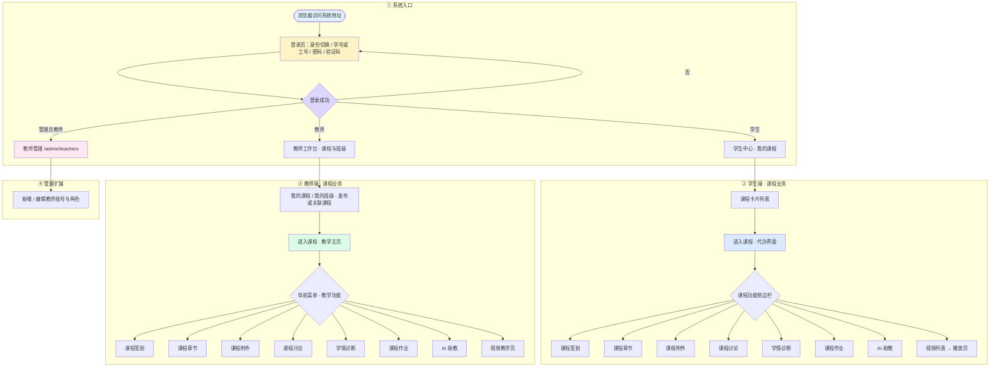
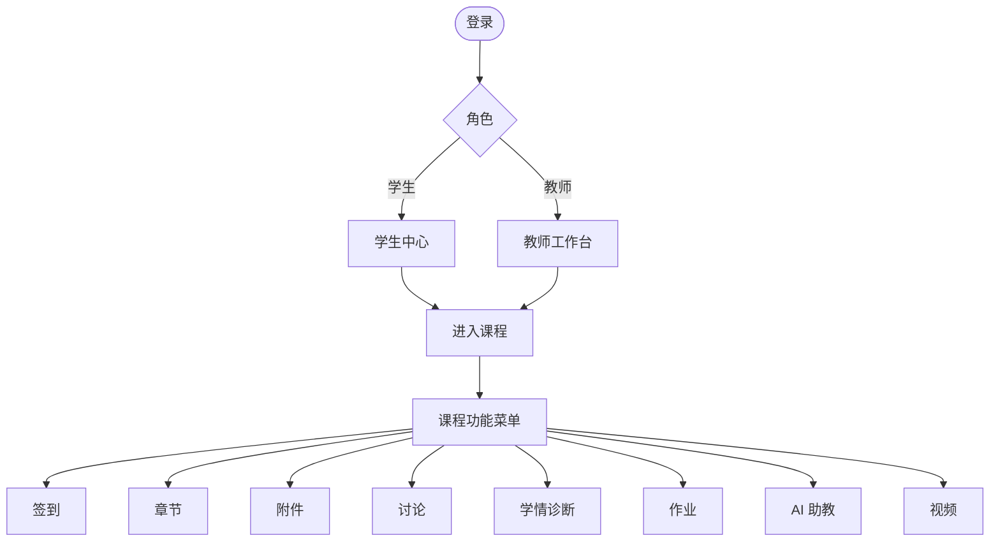

# 课程业务流程示意（图6）

对应说明书「课程业务流程示意（文字链路与页面跳转）」。可在支持 Mermaid 的编辑器（如 VS Code 插件、GitHub、Typora）中预览并导出为 PNG/SVG 插入论文。

---

## 总览：从登录到课程各模块

---

## 简化版（适合幻灯片 / 单栏排版）

---

## 导出图片建议

1. **VS Code**：安装「Markdown Preview Mermaid Support」或「Mermaid Chart」，打开本文件预览后截图或使用 Mermaid Live Editor（https://mermaid.live）粘贴代码块内语句导出 SVG/PNG。
2. **说明书**：将总览图导出为高清 PNG，在 Word 中作为「图6 课程业务流程示意」插入。
