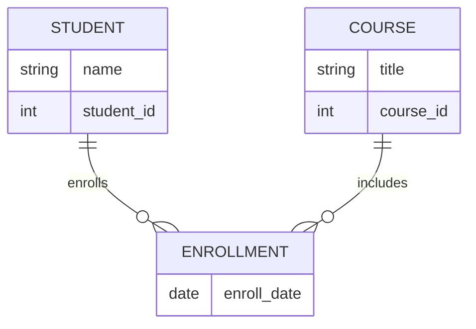

# 数据库ER图

```mermaid
erDiagram
    %% 基础表
    students {
        UUID id PK
        VARCHAR student_id UK
        VARCHAR password
        VARCHAR name
        VARCHAR grade
        VARCHAR major
        TIMESTAMP created_at
    }

    teachers {
        UUID id PK
        VARCHAR teacher_id UK
        VARCHAR password
        VARCHAR name
        VARCHAR department
        VARCHAR title
        VARCHAR role
        TIMESTAMP created_at
    }

    classes {
        UUID id PK
        VARCHAR class_id UK
        VARCHAR class_name
        VARCHAR grade
        TIMESTAMP created_at
    }

    courses {
        UUID id PK
        VARCHAR course_id UK
        VARCHAR course_name
        FLOAT credit
        TIMESTAMP created_at
    }

    %% 关联表
    student_class {
        UUID id PK
        UUID student_id FK
        UUID class_id FK
        TIMESTAMP created_at
    }

    teacher_class {
        UUID id PK
        UUID teacher_id FK
        UUID class_id FK
        TIMESTAMP created_at
    }

    class_course {
        UUID id PK
        UUID class_id FK
        UUID course_id FK
        TIMESTAMP created_at
    }

    %% 课程相关表
    course_videos {
        UUID id PK
        UUID course_id FK
        TEXT video_url
        VARCHAR title
        VARCHAR duration
        INTEGER order_index
        TIMESTAMP created_at
    }

    video_comments {
        UUID id PK
        UUID video_id FK
        UUID student_id FK
        TEXT content
        INT rating
        VARCHAR status
        TIMESTAMP created_at
        TIMESTAMP updated_at
    }

    video_play_duration {
        UUID id PK
        UUID student_id FK
        UUID video_id FK
        INT duration
        TIMESTAMP created_at
    }

    course_attendance {
        UUID id PK
        UUID course_id FK
        UUID teacher_id FK
        VARCHAR title
        VARCHAR code
        TIMESTAMP start_time
        TIMESTAMP end_time
        TIMESTAMP created_at
    }

    attendance_records {
        UUID id PK
        UUID attendance_id FK
        UUID course_id FK
        UUID student_id FK
        TIMESTAMP check_in_time
        VARCHAR status
        TIMESTAMP created_at
    }

    course_resources {
        UUID id PK
        UUID course_id FK
        UUID teacher_id FK
        TEXT resource_url
        VARCHAR title
        TEXT description
        VARCHAR resource_type
        TIMESTAMP created_at
    }

    resource_downloads {
        UUID id PK
        UUID resource_id FK
        UUID student_id FK
        TIMESTAMP download_time
    }

    discussion_topics {
        UUID id PK
        UUID course_id FK
        UUID teacher_id FK
        VARCHAR title
        TEXT content
        TIMESTAMP created_at
    }

    topic_comments {
        UUID id PK
        UUID topic_id FK
        UUID student_id FK
        TEXT content
        VARCHAR status
        TIMESTAMP created_at
        TIMESTAMP updated_at
    }

    assignment_topics {
        UUID id PK
        UUID course_id FK
        UUID teacher_id FK
        VARCHAR title
        TEXT content
        TIMESTAMP start_time
        TIMESTAMP end_time
        TIMESTAMP created_at
    }

    assignments {
        UUID id PK
        UUID assignment_topic_id FK
        UUID student_id FK
        TEXT content
        TIMESTAMP submit_time
        FLOAT score
        VARCHAR status
    }

    %% AI助教相关表
    ai_teaching_assistant_files {
        UUID id PK
        UUID teacher_id FK
        UUID course_id FK
        VARCHAR file_name
        TEXT file_path
        VARCHAR file_type
        BIGINT file_size
        TEXT content
        TIMESTAMP created_at
    }

    ai_teaching_assistant_embeddings {
        UUID id PK
        UUID file_id FK
        VARCHAR chunk_id
        TEXT content
        JSONB embedding
        TIMESTAMP created_at
    }

    %% 关系定义
    students ||--o{ student_class : "参与"
    classes ||--o{ student_class : "包含"
    teachers ||--o{ teacher_class : "教授"
    classes ||--o{ teacher_class : "被教授"
    classes ||--o{ class_course : "选修"
    courses ||--o{ class_course : "被选修"
    courses ||--o{ course_videos : "包含"
    course_videos ||--o{ video_comments : "被评论"
    students ||--o{ video_comments : "评论"
    course_videos ||--o{ video_play_duration : "被观看"
    students ||--o{ video_play_duration : "观看"
    courses ||--o{ course_attendance : "发起"
    teachers ||--o{ course_attendance : "创建"
    course_attendance ||--o{ attendance_records : "记录"
    students ||--o{ attendance_records : "签到"
    courses ||--o{ course_resources : "提供"
    teachers ||--o{ course_resources : "上传"
    course_resources ||--o{ resource_downloads : "被下载"
    students ||--o{ resource_downloads : "下载"
    courses ||--o{ discussion_topics : "包含"
    teachers ||--o{ discussion_topics : "创建"
    discussion_topics ||--o{ topic_comments : "被评论"
    students ||--o{ topic_comments : "评论"
    courses ||--o{ assignment_topics : "布置"
    teachers ||--o{ assignment_topics : "创建"
    assignment_topics ||--o{ assignments : "提交"
    students ||--o{ assignments : "完成"
    courses ||--o{ ai_teaching_assistant_files : "关联"
    teachers ||--o{ ai_teaching_assistant_files : "上传"
    ai_teaching_assistant_files ||--o{ ai_teaching_assistant_embeddings : "包含"
```

```mermaid
erDiagram
   STUDENT {
       string name
       int student_id
   }
   COURSE {
       string title
       int course_id
   }
   ENROLLMENT {
       date enroll_date
   }
   STUDENT ||--o{ ENROLLMENT : enrolls
   COURSE ||--o{ ENROLLMENT : includes
```