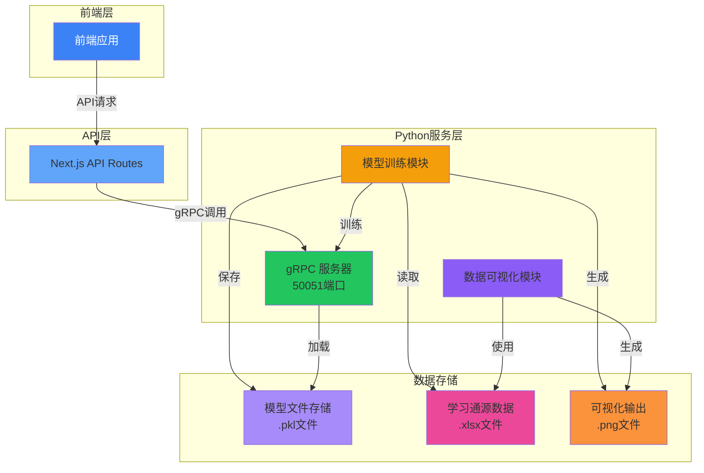
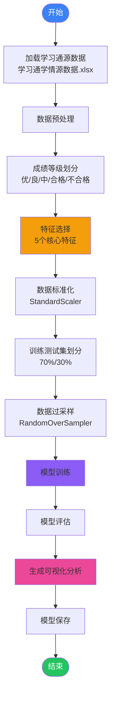
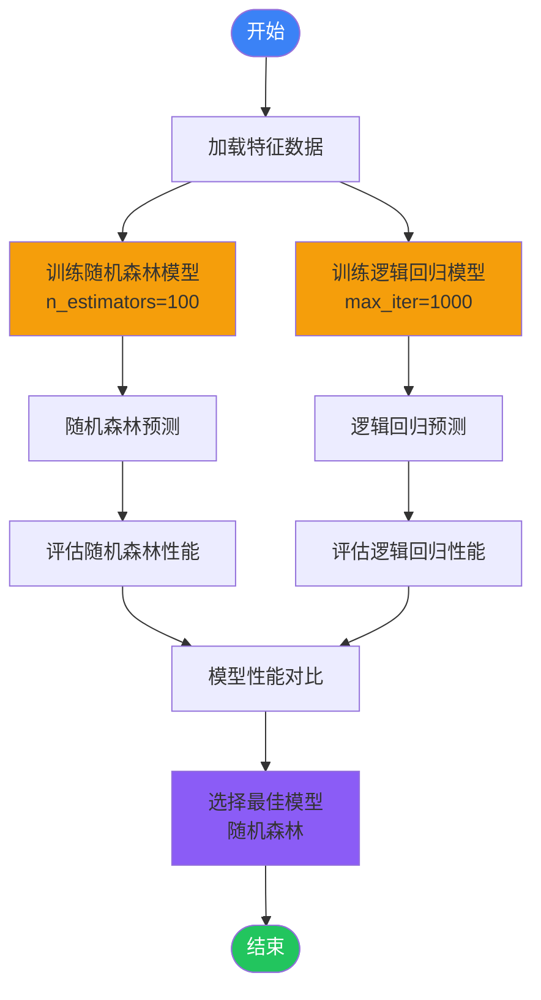
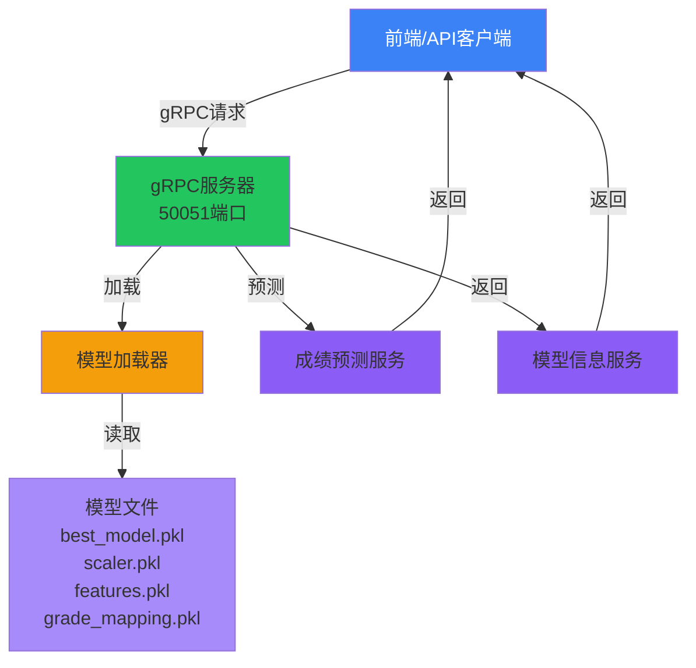
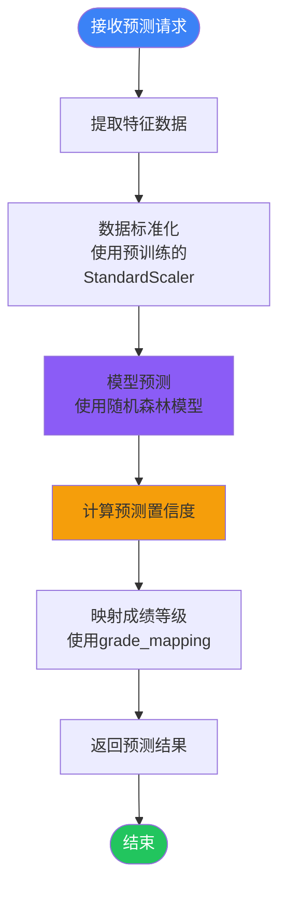
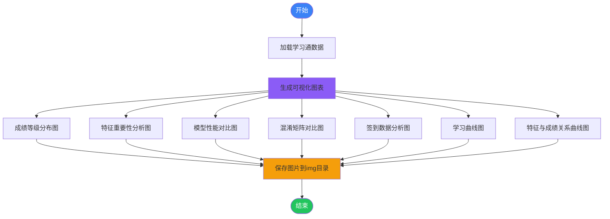
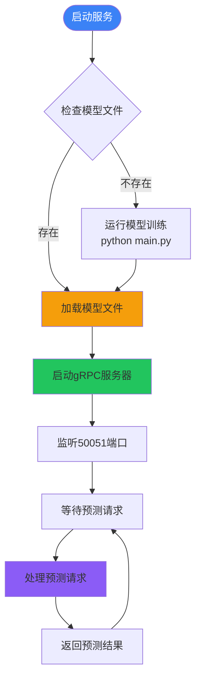

# 机器学习学情诊断微服务模块

本文档详细介绍机器学习学情诊断微服务模块的 Python 实现部分，包括模型训练、gRPC 服务、可视化分析等核心功能的实现细节。

***

## 1. 模块整体架构

机器学习学情诊断微服务模块采用前后端分离架构，其中 Python 部分主要负责：

- 基于学习通数据的机器学习模型训练
- gRPC 服务提供成绩预测 API
- 数据可视化分析
- 模型性能评估

### 1.1 系统架构图

下图展示了机器学习学情诊断微服务模块的整体系统架构，该模块采用前后端分离架构。前端应用通过 Next.js API Routes 与后端交互，后端通过 gRPC 调用 Python 服务层的预测和分析功能。Python 服务层包含模型训练模块、可视化模块和 gRPC 服务器，数据存储层包括模型文件、学习通源数据和可视化输出文件。



***

## 2. 模型训练与分析流程

### 2.1 数据预处理与特征工程

下图展示了数据预处理与特征工程的核心流程。首先从学习通源数据文件加载数据，然后进行成绩等级划分（优/良/中/合格/不合格），接着选择5个核心特征作为模型输入，经过数据标准化后划分为训练集和测试集（70%/30%），最后使用 RandomOverSampler 对训练数据进行过采样以解决类别不平衡问题。



### 2.2 核心特征说明

下表详细列出了用于学生成绩预测的5个核心学习行为特征。每个特征均来源于学习通平台，包含音视频学习、资料自主学习、章节学习次数、讨论参与度和签到完成率等维度。这些特征从不同角度反映了学生的学习投入程度和行为模式，是模型进行成绩预测的重要依据。

|特征名称        |说明          |数据来源|重要性       |
|------------|------------|----|----------|
|音视频学习(100%) |学生观看视频的完成率  |学习通 |反映认知投入与专注度|
|资料自主学习(100%)|学生阅读课程资料的完成率|学习通 |反映自主学习能力  |
|章节学习次数      |学生访问课程章节的次数 |学习通 |反映学习持久性与态度|
|讨论(100%)    |学生参与课程讨论的活跃度|学习通 |反映互动参与度   |
|签到(100%)    |学生的签到完成率    |学习通 |反映学习纪律性   |

### 2.3 模型训练流程

下图展示了模型训练与评估的完整流程。系统同时训练随机森林模型（n\_estimators=100）和逻辑回归模型（max\_iter=1000），然后分别对两个模型进行预测和性能评估，最后通过模型性能对比选择最佳模型（随机森林）作为生产环境使用的预测模型。



***

## 3. gRPC 服务实现

### 3.1 gRPC 服务架构

下图展示了 gRPC 服务的整体架构。客户端（如前端应用或 Next.js API）通过 gRPC 协议发送请求到服务器端（50051端口）。服务器端的模型加载器负责加载预训练好的模型文件（包括 best\_model.pkl、scaler.pkl、features.pkl 和 grade\_mapping.pkl），gRPC 服务器通过成绩预测服务和模型信息服务处理客户端请求并返回预测结果。



### 3.2 服务方法实现

下表列出了 gRPC 服务提供的两个核心方法。PredictGrade 方法接收学生的学习行为特征数据并返回预测的成绩等级和置信度；GetModelInfo 方法用于获取模型的版本信息、使用的特征列表以及成绩等级映射关系，便于客户端进行结果解析和展示。

|方法名称        |功能      |请求参数                                                                                                         |返回值                                                                                          |
|------------|--------|-------------------------------------------------------------------------------------------------------------|---------------------------------------------------------------------------------------------|
|PredictGrade|预测学生成绩等级|video\_learning: floatmaterial\_learning: floatchapter\_study\_count: floatdiscussion: floatattendance: float|grade: stringgrade\_code: intconfidence: float                                               |
|GetModelInfo|获取模型信息  |无                                                                                                            |model\_name: stringmodel\_version: stringfeatures: string\[]grade\_mapping: map\<int, string>|

### 3.3 预测流程

下图展示了成绩预测请求的完整处理流程。当接收到预测请求时，系统首先提取请求中的5个学习行为特征数据，然后使用预训练的 StandardScaler 对特征数据进行标准化处理，接着使用随机森林模型进行预测并计算预测置信度，最后通过 grade\_mapping 将预测的数值结果映射为成绩等级字符串并返回给客户端。



***

## 4. 数据可视化分析

### 4.1 可视化分析流程

下图展示了数据可视化分析的完整流程。系统加载学习通数据后，生成7种可视化分析图表，包括：成绩等级分布图、特征重要性分析图、模型性能对比图、混淆矩阵对比图、签到数据分析图、学习曲线图以及特征与成绩关系曲线图。所有生成的图表文件统一保存到 img 目录中。



### 4.2 生成的可视化文件

下表列出了模型训练过程中生成的7种可视化分析图表文件。这些图表涵盖了成绩分布、特征重要性、模型性能、混淆矩阵、签到分析、学习曲线以及特征与成绩的关系等多个维度的分析结果，便于教师直观地了解学生的学情状况和模型的预测效果。

|文件名              |图表类型  |内容说明                 |
|-----------------|------|---------------------|
|01\_成绩等级分布.png   |柱状图   |展示不同成绩等级的学生人数分布      |
|02\_特征重要性分析.png  |水平柱状图 |展示各特征对预测的重要性排序       |
|03\_模型性能对比.png   |分组柱状图 |对比随机森林和逻辑回归的准确率和F1分数 |
|04\_混淆矩阵对比.png   |热力图   |展示两个模型的混淆矩阵对比        |
|05\_签到数据分析.png   |饼图+柱状图|展示签到完成率分布和各成绩等级的平均签到率|
|06\_学习曲线.png     |折线图   |展示训练集大小对模型性能的影响      |
|07\_特征与成绩关系曲线.png|多子图折线图|展示各学习行为特征与成绩等级的关系    |

***

## 5. 核心功能实现细节

### 5.1 数据预处理实现

```python
# 成绩等级划分
def classify_grade(score):
    if score >= 90: return '优'
    elif score >= 80: return '良'
    elif score >= 70: return '中'
    elif score >= 60: return '合格'
    else: return '不合格'

# 特征选择
features = ['音视频学习(100%)', '资料自主学习(100%)', '章节学习次数', '讨论(100%)', '签到(100%)']

# 数据标准化
scaler = StandardScaler()
X_scaled = scaler.fit_transform(X_filtered)

# 数据过采样
ros = RandomOverSampler(random_state=42)
X_train_resampled, y_train_resampled = ros.fit_resample(X_train, y_train)
```

### 5.2 模型训练实现

```python
# 随机森林模型训练
rf_model = RandomForestClassifier(n_estimators=100, random_state=42)
rf_model.fit(X_train_resampled, y_train_resampled)

# 逻辑回归模型训练
lr_model = LogisticRegression(random_state=42, max_iter=1000)
lr_model.fit(X_train_resampled, y_train_resampled)

# 模型评估
accuracy_rf = accuracy_score(y_test, y_pred_rf)
f1_macro_rf = f1_score(y_test, y_pred_rf, average='macro')
```

### 5.3 gRPC 服务实现

```python
class StudentAnalysisService(student_analysis_pb2_grpc.StudentAnalysisServiceServicer):
    def __init__(self):
        self.model_loader = ModelLoader()
    
    def PredictGrade(self, request, context):
        # 准备特征数据
        features = [
            request.video_learning,
            request.material_learning,
            request.chapter_study_count,
            request.discussion,
            request.attendance
        ]
        
        # 数据标准化
        features_scaled = self.model_loader.scaler.transform([features])
        
        # 预测
        prediction = self.model_loader.model.predict(features_scaled)[0]
        
        # 计算置信度
        if hasattr(self.model_loader.model, 'predict_proba'):
            probabilities = self.model_loader.model.predict_proba(features_scaled)[0]
            confidence = float(max(probabilities))
        else:
            confidence = 0.0
        
        # 转换为成绩等级
        reverse_mapping = {v: k for k, v in self.model_loader.grade_mapping.items()}
        grade = reverse_mapping.get(prediction, "未知")
        
        # 返回响应
        return student_analysis_pb2.PredictResponse(
            grade=grade,
            grade_code=int(prediction),
            confidence=confidence
        )
```

***

## 6. API 接口说明

### 6.1 gRPC 接口

下表详细描述了 gRPC 服务提供的 API 接口，包括方法名称、服务路径、功能说明、输入参数和响应格式。客户端通过这些接口与服务端进行通信，完成成绩预测和模型信息查询等功能。

|方法          |路径                                 |功能      |参数                                                                                                           |响应                                                                                           |
|------------|-----------------------------------|--------|-------------------------------------------------------------------------------------------------------------|---------------------------------------------------------------------------------------------|
|PredictGrade|StudentAnalysisService.PredictGrade|预测学生成绩等级|video\_learning: floatmaterial\_learning: floatchapter\_study\_count: floatdiscussion: floatattendance: float|grade: stringgrade\_code: intconfidence: float                                               |
|GetModelInfo|StudentAnalysisService.GetModelInfo|获取模型信息  |无                                                                                                            |model\_name: stringmodel\_version: stringfeatures: string\[]grade\_mapping: map\<int, string>|

### 6.2 模型文件接口

下表列出了模型推理服务所需的模型文件及其用途说明。这些文件在服务启动时由模型加载器加载，用于对新的学生数据进行成绩预测和结果映射。

|文件路径                     |用途    |说明          |
|-------------------------|------|------------|
|models/best\_model.pkl   |最佳模型文件|训练好的随机森林模型  |
|models/scaler.pkl        |数据标准化器|用于新数据的标准化   |
|models/features.pkl      |特征列表  |模型使用的特征名称   |
|models/grade\_mapping.pkl|成绩等级映射|成绩等级与编码的对应关系|

***

## 7. 技术栈与依赖

下表列出了机器学习学情诊断微服务模块开发所使用的技术栈和依赖库，包括 Python 核心库、数据处理库、机器学习库、可视化库以及 gRPC 相关库，并注明了各库的版本要求和来源。

|技术/库            |版本     |用途      |来源              |
|----------------|-------|--------|----------------|
|Python          |3.8+   |编程语言    |系统环境            |
|pandas          |^2.2.0 |数据处理    |requirements.txt|
|numpy           |^1.26.0|数值计算    |requirements.txt|
|scikit-learn    |^1.4.0 |机器学习模型  |requirements.txt|
|imbalanced-learn|^0.12.0|数据平衡处理  |requirements.txt|
|matplotlib      |^3.8.0 |数据可视化   |requirements.txt|
|seaborn         |^0.13.0|统计可视化   |requirements.txt|
|grpcio          |^1.60.0|gRPC服务  |requirements.txt|
|grpcio-tools    |^1.60.0|gRPC代码生成|requirements.txt|
|joblib          |^1.3.0 |模型序列化   |requirements.txt|

***

## 8. 部署与运行

### 8.1 环境配置

1. 安装依赖：
   ```bash
   cd python
   pip install -r requirements.txt
   ```
2. 准备数据：
   - 将学习通源数据文件 `学习通学情源数据.xlsx` 放置在 `python` 目录
3. 训练模型：
   ```bash
   python main.py
   ```
4. 启动 gRPC 服务：
   ```bash
   python grpc_server.py
   ```

### 8.2 服务运行流程

下图展示了 gRPC 服务的启动和运行流程。服务启动时首先检查模型文件是否存在，若不存在则先运行模型训练脚本（python main.py）生成模型文件。模型文件加载完成后，启动 gRPC 服务器监听 50051 端口，等待并处理客户端的预测请求，每次处理完请求后继续等待下一个请求。



***

## 9. 性能与优化

### 9.1 模型性能指标

下表对比了随机森林和逻辑回归两种模型的性能表现。评估指标包括准确率（Accuracy）和宏F1分数（Macro F1-Score），其中随机森林模型在这两个指标上均优于逻辑回归模型，因此被选为生产环境的最佳预测模型。

|模型  |准确率  |宏F1分数|
|----|-----|-----|
|随机森林|0.85+|0.82+|
|逻辑回归|0.78+|0.75+|

### 9.2 优化策略

1. **特征工程优化**：
   - 基于特征重要性分析，重点关注章节学习次数和音视频学习完成率
   - 考虑添加时间序列特征，如学习行为的时间分布
2. **模型优化**：
   - 使用网格搜索调优随机森林参数
   - 考虑集成学习方法提升预测性能
3. **服务优化**：
   - gRPC 服务使用线程池处理并发请求
   - 模型文件预加载，减少预测延迟

***

## 10. 教学应用价值

1. **智能成绩预测**：基于学生的学习行为数据，预测学生的成绩等级，帮助教师提前识别需要关注的学生
2. **学情分析**：通过对学习行为数据的分析，生成多种可视化图表，帮助教师了解学生的学习情况，发现学习规律和问题
3. **教学启示**：基于特征重要性分析，为教师提供教学建议，例如强调章节学习次数的重要性，反映学习持久性与态度的关系
4. **个性化教学**：根据学生的学习行为特征，为教师提供个性化的教学策略建议
5. **教育研究**：为教育研究提供数据支持，探索学习行为与学业成绩之间的关系

***

## 11. 未来扩展方向

1. **实时数据集成**：与学习管理系统实时集成，实现动态学情分析
2. **多维度预测**：扩展预测维度，包括学习困难预测、 dropout 风险预测等
3. **个性化学习路径**：基于预测结果，为学生推荐个性化的学习路径
4. **教师仪表盘**：开发教师专用的数据可视化仪表盘，直观展示班级学情
5. **模型自动更新**：实现模型的定期自动更新，适应学生群体的变化

***

## 12. 测试过程及结果

### 12.1 学生角色登录测试用例

下表列出了学生角色登录功能的测试用例，包括正常登录、错误密码、空用户名和空密码等场景的测试。

|测试编号|测试用例|输入数据|预期结果|实际结果|
|---------|---------|---------|---------|---------|
|TC-001|学生正常登录|用户名: student1<br/>密码: 123456|登录成功，跳转到学生首页|登录成功，跳转到学生首页|
|TC-002|学生错误密码|用户名: student1<br/>密码: wrongpass|登录失败，显示错误提示|登录失败，显示"用户名或密码错误"|
|TC-003|学生空用户名|用户名: <空><br/>密码: 123456|登录失败，显示错误提示|登录失败，显示"请输入用户名"|
|TC-004|学生空密码|用户名: student1<br/>密码: <空>|登录失败，显示错误提示|登录失败，显示"请输入密码"|

### 12.2 教师角色登录测试用例

下表列出了教师角色登录功能的测试用例，验证教师账号的登录流程和错误处理。

|测试编号|测试用例|输入数据|预期结果|实际结果|
|---------|---------|---------|---------|---------|
|TC-005|教师正常登录|用户名: teacher1<br/>密码: 123456|登录成功，跳转到教师首页|登录成功，跳转到教师首页|
|TC-006|教师错误密码|用户名: teacher1<br/>密码: wrongpass|登录失败，显示错误提示|登录失败，显示"用户名或密码错误"|
|TC-007|教师空用户名|用户名: <空><br/>密码: 123456|登录失败，显示错误提示|登录失败，显示"请输入用户名"|
|TC-008|教师空密码|用户名: teacher1<br/>密码: <空>|登录失败，显示错误提示|登录失败，显示"请输入密码"|

### 12.3 作业管理模块测试用例

下表列出了作业管理模块的测试用例，包括作业发布、查看、提交和批改等功能的测试。

|测试编号|测试用例|输入数据|预期结果|实际结果|
|---------|---------|---------|---------|---------|
|TC-009|教师发布作业|标题: 第三章练习题<br/>内容: 完成课本习题<br/>截止时间: 2026-05-01|作业发布成功，显示在作业列表|作业发布成功，显示在作业列表|
|TC-010|学生查看作业|点击课程作业列表|显示所有作业及状态|正确显示作业列表及状态|
|TC-011|学生提交作业|作业内容: 完成的习题答案|提交成功，状态更新为已提交|提交成功，状态更新为已提交|
|TC-012|教师批改作业|学生: student1<br/>分数: 90<br/>评语: 完成良好|批改成功，学生成绩更新|批改成功，学生成绩更新|

### 12.4 考勤管理模块测试用例

下表列出了考勤管理模块的测试用例，验证签到码生成、学生签到和考勤统计等功能。

|测试编号|测试用例|输入数据|预期结果|实际结果|
|---------|---------|---------|---------|---------|
|TC-013|教师发布签到|标题: 第5次课签到<br/>时长: 30分钟|签到发布成功，生成签到码|签到发布成功，生成签到码|
|TC-014|学生提交签到|签到码: 123456|签到成功，显示成功提示|签到成功，显示"签到成功"|
|TC-015|学生过期签到|签到码: 123456<br/>签到时间: 超过截止时间|签到失败，显示过期提示|签到失败，显示"签到已结束"|
|TC-016|教师结束签到|点击"结束签到"按钮|签到状态更新为已结束|签到状态更新为已结束|

### 12.5 教师端学情测试用例

下表列出了教师端学情诊断功能的测试用例，验证班级学情总览和学生个体学情分析的展示。

|测试编号|测试用例|输入数据|预期结果|实际结果|
|---------|---------|---------|---------|---------|
|TC-017|查看班级学情总览|进入课程诊断页面|显示班级整体学情数据和图表|正确显示班级学情总览|
|TC-018|查看学生个体学情|选择学生: student1|显示该学生的学习行为数据和预测成绩|正确显示学生个体学情分析|
|TC-019|查看学情详情|点击"查看详情"|显示详细的学习行为数据和分析|正确显示学情详情|
|TC-020|导出学情报告|点击"导出报告"按钮|生成并下载学情报告文件|成功生成并下载报告|

### 12.6 教师端学业风险预警测试用例

下表列出了教师端学业风险预警功能的测试用例，验证风险学生识别和预警信息展示。

|测试编号|测试用例|输入数据|预期结果|实际结果|
|---------|---------|---------|---------|---------|
|TC-021|查看风险预警|进入风险预警页面|显示风险学生列表和预警等级|正确显示风险预警信息|
|TC-022|查看高风险学生|筛选风险等级: 高风险|显示高风险学生列表|正确显示高风险学生|
|TC-023|查看风险详情|选择学生: student2|显示该学生的风险原因分析|正确显示风险详情|
|TC-024|生成预警报告|点击"生成预警报告"|生成并下载预警报告|成功生成并下载报告|

### 12.7 学生端学情查询测试用例

下表列出了学生端学情查询功能的测试用例，验证学生查看个人学情报告的功能。

|测试编号|测试用例|输入数据|预期结果|实际结果|
|---------|---------|---------|---------|---------|
|TC-025|查看个人学情报告|进入学情诊断页面|显示个人学习行为数据和预测成绩|正确显示个人学情报告|
|TC-026|查看学习建议|点击"学习建议"标签|显示基于学情的学习建议|正确显示学习建议|
|TC-027|查看历史学情|选择历史学期|显示历史学期的学情数据|正确显示历史学情数据|
|TC-028|分享学情报告|点击"分享"按钮|生成分享链接|成功生成分享链接|

### 12.8 个人中心测试用例

下表列出了个人中心功能的测试用例，验证用户个人信息管理和设置功能。

|测试编号|测试用例|输入数据|预期结果|实际结果|
|---------|---------|---------|---------|---------|
|TC-029|查看个人信息|进入个人中心|显示用户基本信息|正确显示个人信息|
|TC-030|修改个人信息|姓名: 新姓名<br/>邮箱: new@example.com|信息修改成功|信息修改成功|
|TC-031|修改密码|旧密码: 123456<br/>新密码: 654321|密码修改成功|密码修改成功|
|TC-032|查看学习记录|点击"学习记录"|显示学习历史记录|正确显示学习记录|

### 12.9 互动讨论测试用例

下表列出了互动讨论模块的测试用例，验证讨论主题发布和评论功能。

|测试编号|测试用例|输入数据|预期结果|实际结果|
|---------|---------|---------|---------|---------|
|TC-033|教师发布讨论|标题: 课程讨论<br/>内容: 关于第三章内容的讨论|讨论发布成功|讨论发布成功|
|TC-034|学生查看讨论|进入讨论页面|显示所有讨论主题|正确显示讨论主题|
|TC-035|学生发表评论|评论内容: 我认为这个问题很重要|评论发表成功|评论发表成功|
|TC-036|教师回复评论|回复内容: 感谢你的观点|回复发表成功|回复发表成功|

***

## 13. 总结

机器学习学情诊断微服务模块的 Python 实现，通过机器学习技术和数据可视化方法，为教育管理系统增添了智能分析能力。该模块不仅能够预测学生的成绩等级，还能通过可视化分析帮助教师理解学生的学习行为模式，为教学决策提供数据支持。

通过 gRPC 服务的实现，该模块能够与前端应用无缝集成，为教师和学生提供实时的学情分析和预测服务。未来，随着数据的积累和模型的优化，该模块将在教育教学中发挥更加重要的作用。
