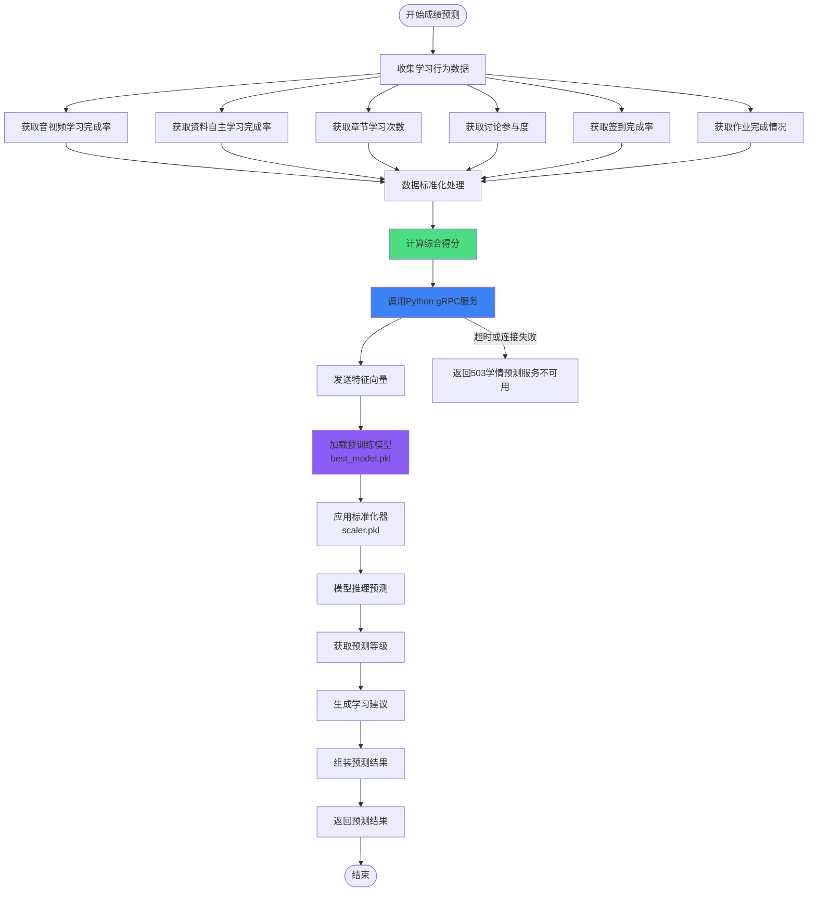
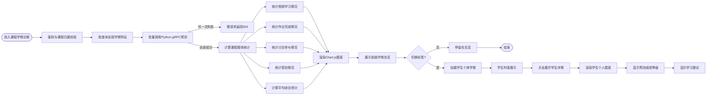
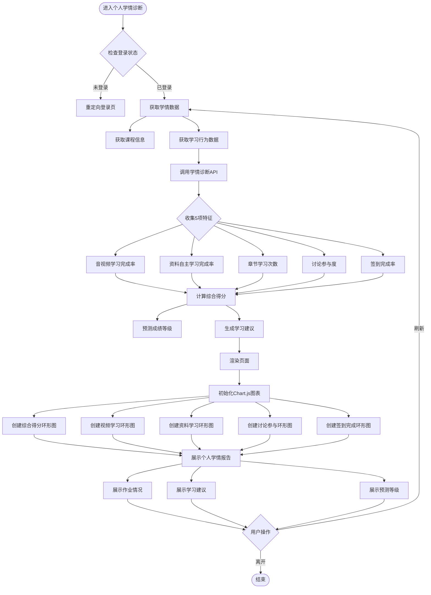
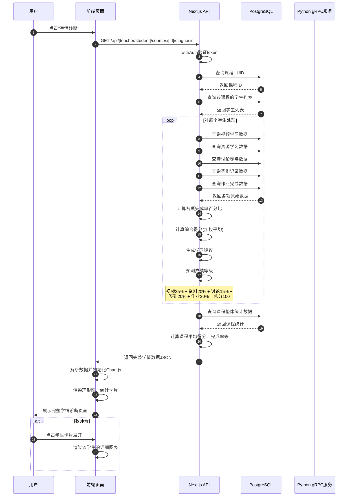
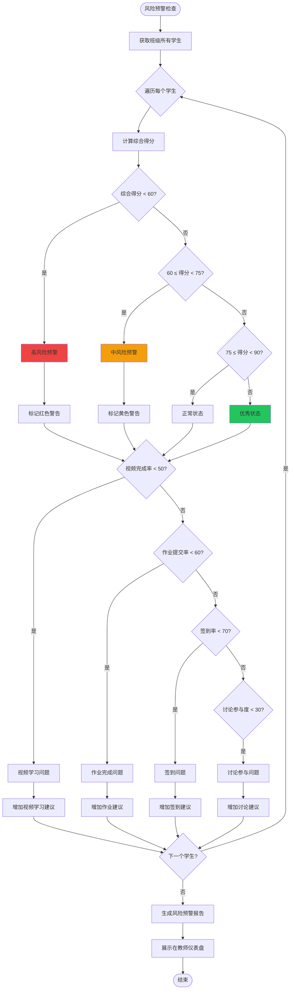

# 学情诊断流程图

## 1. 学情诊断完整数据流图

```mermaid
flowchart LR
    subgraph 前端层
        subgraph 教师端
            TeacherDiagnosis[教师学情诊断页面<br/>/teacher/course/[id]/diagnosis]
            TeacherOverview[课程整体学情总览]
            TeacherStudents[学生个体学情分析]
        end
        
        subgraph 学生端
            StudentDiagnosis[学生学情诊断页面<br/>/student/course/[id]/diagnosis]
            StudentReport[个人学情报告展示]
        end
    end
    
    subgraph API层
        TeacherDiagnosisAPI[GET /api/teacher/courses/[id]/diagnosis<br/>教师学情诊断API]
        StudentDiagnosisAPI[GET /api/student/courses/[id]/diagnosis<br/>学生学情诊断API]
    end
    
    subgraph 数据处理层
        DataCollection[数据收集模块]
        ScoreCalculation[综合得分计算]
        SuggestionGenerator[学习建议生成]
        GradePrediction[成绩等级预测]
    end
    
    subgraph 数据库层
        StudentsDB[students表]
        VideosDB[course_videos表<br/>video_play_duration表]
        ResourcesDB[course_resources表<br/>resource_downloads表]
        DiscussionDB[discussion_topics表<br/>topic_comments表]
        AttendanceDB[course_attendance表<br/>attendance_records表]
        AssignmentDB[assignment_topics表<br/>assignments表]
    end
    
    subgraph 机器学习服务层
        PythonGRPC[Python gRPC服务]
        ModelInference[模型推理预测]
    end
    
    TeacherDiagnosis-->|切换标签|TeacherOverview
    TeacherDiagnosis-->|切换标签|TeacherStudents
    StudentDiagnosis-->|显示|StudentReport
    
    TeacherDiagnosis-->|请求|TeacherDiagnosisAPI
    StudentDiagnosis-->|请求|StudentDiagnosisAPI
    
    TeacherDiagnosisAPI-->|调用|DataCollection
    StudentDiagnosisAPI-->|调用|DataCollection
    
    DataCollection-->|查询|StudentsDB
    DataCollection-->|查询|VideosDB
    DataCollection-->|查询|ResourcesDB
    DataCollection-->|查询|DiscussionDB
    DataCollection-->|查询|AttendanceDB
    DataCollection-->|查询|AssignmentDB
    
    DataCollection-->|原始数据|ScoreCalculation
    ScoreCalculation-->|计算结果|SuggestionGenerator
    SuggestionGenerator-->|生成建议|GradePrediction
    
    GradePrediction-->|必须调用|PythonGRPC
    PythonGRPC-->|预测结果|ModelInference
    ModelInference-->|返回等级|GradePrediction
    PythonGRPC-->|失败|Err503[API返回503]
    
    TeacherDiagnosisAPI-->|返回JSON|TeacherDiagnosis
    StudentDiagnosisAPI-->|返回JSON|StudentDiagnosis
```

## 2. 成绩预测流程图



## 3. 班级学情总览流程图



## 4. 个人学情报告流程图



## 5. 学情诊断数据处理时序图



## 6. 学业风险预警流程图


