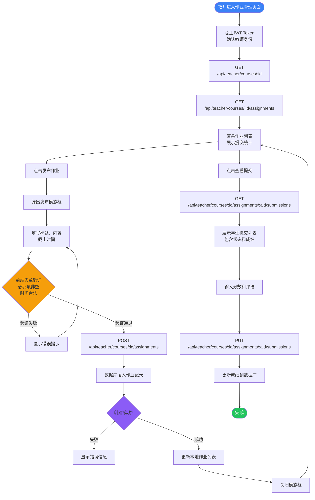
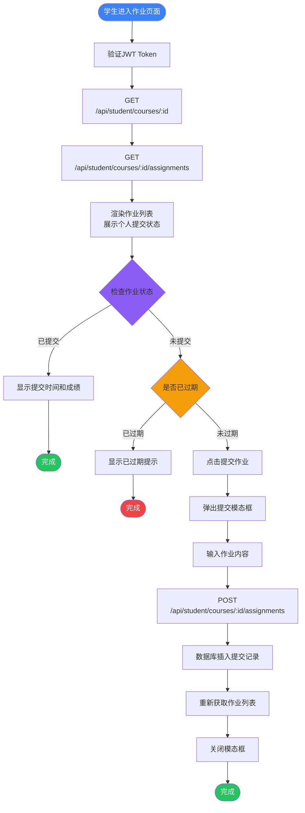
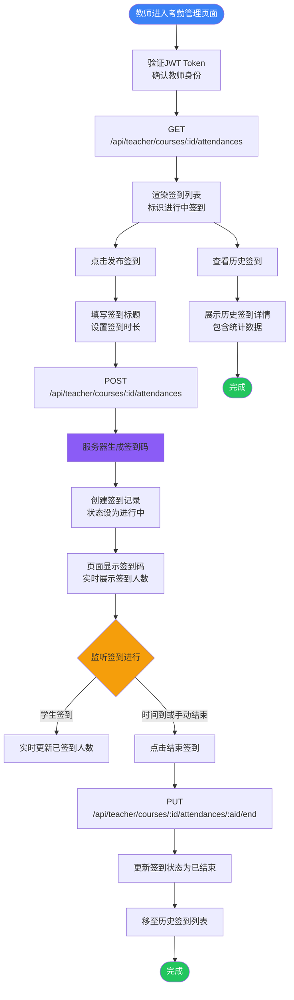
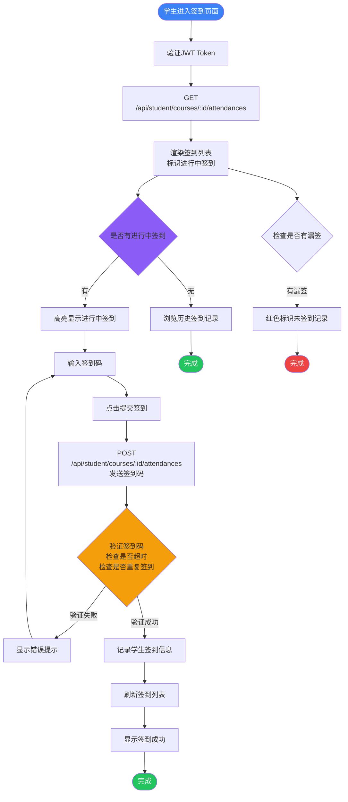
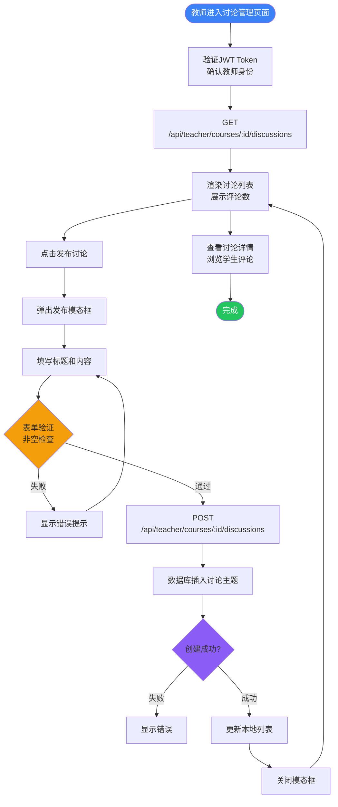
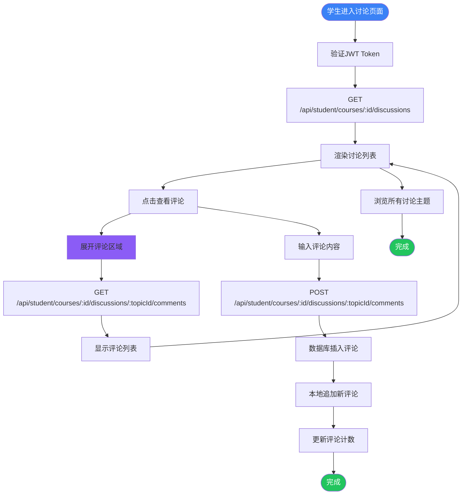
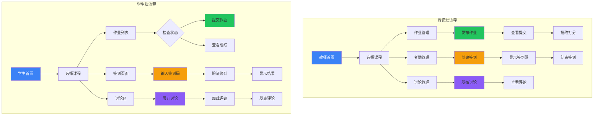

# 教学管理模块流程图

本文档包含教学管理模块三大核心功能（作业管理、考勤管理、讨论管理）的用户操作流程图。

***

## 1. 作业管理功能流程图

### 1.1 教师端作业管理流程

### 1.2 学生端作业管理流程

***

## 2. 考勤管理功能流程图

### 2.1 教师端考勤管理流程

### 2.2 学生端考勤管理流程

***

## 3. 讨论管理功能流程图

### 3.1 教师端讨论管理流程

### 3.2 学生端讨论管理流程

***

## 完整教学管理模块流程图（全景）

***

## API 接口汇总

### 课程相关

| 方法     | 路径                                        | 功能       |
| ------ | ----------------------------------------- | -------- |
| GET    | /api/teacher/courses                      | 获取课程列表   |
| POST   | /api/teacher/courses                      | 创建新课程    |
| GET    | /api/teacher/courses/:id                  | 获取课程详情   |
| GET    | /api/teacher/courses/:id/classes          | 获取班级绑定状态 |
| POST   | /api/teacher/courses/:id/classes/:classId | 绑定班级     |
| DELETE | /api/teacher/courses/:id/classes/:classId | 解绑班级     |

### 作业相关

| 方法   | 路径                                                    | 功能     |
| ---- | ----------------------------------------------------- | ------ |
| GET  | /api/teacher/courses/:id/assignments                  | 获取作业列表 |
| POST | /api/teacher/courses/:id/assignments                  | 创建作业   |
| GET  | /api/teacher/courses/:id/assignments/:aid/submissions | 获取学生提交 |
| PUT  | /api/teacher/courses/:id/assignments/:aid/submissions | 批改作业   |
| GET  | /api/student/courses/:id/assignments                  | 获取作业列表 |
| POST | /api/student/courses/:id/assignments                  | 提交作业   |

### 考勤相关

| 方法   | 路径                                            | 功能     |
| ---- | --------------------------------------------- | ------ |
| GET  | /api/teacher/courses/:id/attendances          | 获取签到列表 |
| POST | /api/teacher/courses/:id/attendances          | 创建签到   |
| PUT  | /api/teacher/courses/:id/attendances/:aid/end | 结束签到   |
| GET  | /api/student/courses/:id/attendances          | 获取签到列表 |
| POST | /api/student/courses/:id/attendances          | 提交签到   |

### 讨论相关

| 方法   | 路径                                                     | 功能     |
| ---- | ------------------------------------------------------ | ------ |
| GET  | /api/teacher/courses/:id/discussions                   | 获取讨论列表 |
| POST | /api/teacher/courses/:id/discussions                   | 创建讨论   |
| GET  | /api/student/courses/:id/discussions                   | 获取讨论列表 |
| GET  | /api/student/courses/:id/discussions/:topicId/comments | 获取评论   |
| POST | /api/student/courses/:id/discussions/:topicId/comments | 发表评论   |

