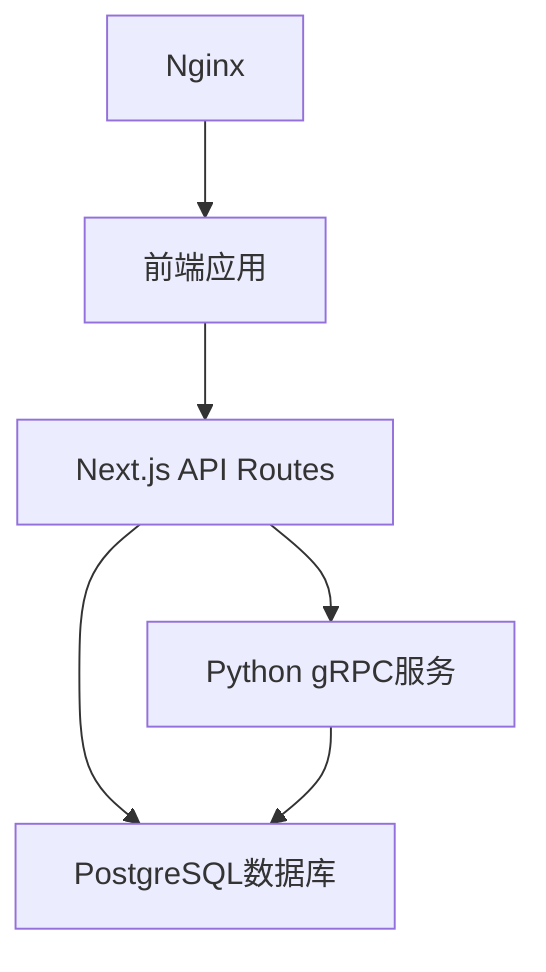
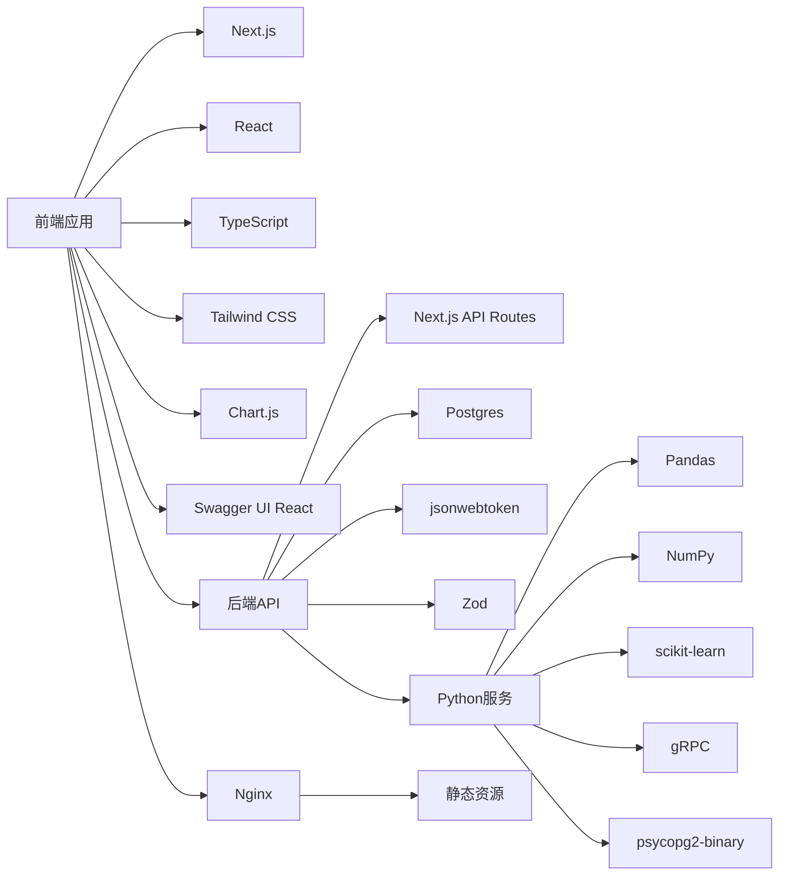

# 项目技术栈文档

## 1. 项目概述

本项目是一个基于Next.js的教育管理系统，包含前端、后端、Python数据分析服务和Nginx静态资源服务。系统主要功能包括学生课程管理、作业管理、考勤管理、讨论管理、视频学习管理以及基于机器学习的学生成绩预测分析。

## 2. 核心技术栈

### 2.1 前端技术

| 技术/库 | 版本 | 用途 | 来源 |
|---------|------|------|------|
| Next.js | ^15.0.0 | 前端框架，提供React服务器端渲染和API路由 | package.json |
| React | 19.2.14 | UI库 | package.json |
| TypeScript | ^5.3.3 | 类型安全的JavaScript超集 | package.json |
| Tailwind CSS | 3.4.17 | 实用优先的CSS框架 | package.json |
| Chart.js | ^4.5.1 | 数据可视化图表库 | package.json |
| Swagger UI React | ^5.32.0 | API文档界面 | package.json |

### 2.2 后端技术

| 技术/库 | 版本 | 用途 | 来源 |
|---------|------|------|------|
| Node.js | - | JavaScript运行时 | package.json |
| Next.js API Routes | - | 后端API路由 | 项目结构 |
| Postgres | ^3.4.4 | PostgreSQL数据库客户端 | package.json |
| jsonwebtoken | ^9.0.3 | JWT认证库 | package.json |
| jose | ^6.2.0 | JWT库，提供额外的JWT功能 | package.json |
| Zod | ^3.22.4 | 数据验证库 | package.json |
| next-swagger-doc | ^0.4.1 | API文档生成 | package.json |

### 2.3 数据库

| 技术 | 版本 | 用途 | 来源 |
|------|------|------|------|
| PostgreSQL | 16-alpine | 关系型数据库 | docker-compose.yml |

### 2.4 测试框架

| 技术 | 版本 | 用途 | 来源 |
|------|------|------|------|
| Vitest | ^1.2.0 | 现代测试框架 | package.json |

### 2.5 Python服务

| 技术/库 | 版本 | 用途 | 来源 |
|---------|------|------|------|
| Python | 3.10+ | 编程语言 | python/Dockerfile |
| Pandas | ^2.3.3 | 数据处理库 | python/requirements.txt |
| NumPy | ^2.2.6 | 数值计算库 | python/requirements.txt |
| Matplotlib | ^3.10.8 | 数据可视化库 | python/requirements.txt |
| Seaborn | ^0.13.2 | 统计数据可视化库 | python/requirements.txt |
| scikit-learn | ^1.7.2 | 机器学习库 | python/requirements.txt |
| imbalanced-learn | ^0.14.1 | 处理不平衡数据集的库 | python/requirements.txt |
| gRPC | ^1.62.0 | 远程过程调用框架 | python/requirements.txt |
| Protocol Buffers | ^4.25.3 | 数据序列化框架 | python/requirements.txt |
| psycopg2-binary | ^2.9.11 | PostgreSQL客户端 | python/requirements.txt |

### 2.6 Nginx

| 技术 | 版本 | 用途 | 来源 |
|------|------|------|------|
| Nginx | alpine | 静态资源服务器，优化视频文件服务 | docker-compose.yml |

### 2.7 容器化

| 技术 | 版本 | 用途 | 来源 |
|------|------|------|------|
| Docker | - | 容器化平台 | docker-compose.yml |
| Docker Compose | ^3.8 | 多容器应用编排 | docker-compose.yml |

## 3. 系统架构

### 3.1 整体架构

### 3.2 模块划分

1. **前端模块**：
   - 学生端：课程学习、作业提交、考勤查看、讨论参与、视频学习
   - 教师端：课程管理、作业批改、考勤管理、讨论管理、视频管理

2. **后端模块**：
   - 认证服务：用户登录、token刷新
   - 学生服务：课程相关操作
   - 教师服务：课程和班级管理
   - Swagger文档服务：API文档生成

3. **Python服务**：
   - 数据分析：基于学习通数据的学情分析
   - 机器学习：学生成绩预测模型
   - gRPC服务：成绩等级预测的**唯一**推理路径；Next.js 诊断 API 必须调用该服务，失败时返回 503（禁止规则降级）

4. **Nginx服务**：
   - 静态资源服务
   - 视频文件优化服务

## 4. 核心功能实现

### 4.1 前端实现

- 使用Next.js App Router进行路由管理
- 使用React 19的新特性构建组件
- 使用Tailwind CSS实现响应式设计
- 使用Chart.js实现数据可视化
- 使用Swagger UI展示API文档

### 4.2 后端实现

- 使用Next.js API Routes构建RESTful API
- 使用Postgres客户端进行数据库操作
- 使用JWT进行用户认证
- 使用Zod进行数据验证
- 使用next-swagger-doc生成API文档

### 4.3 Python服务实现

- 使用Pandas和NumPy进行数据处理
- 使用Matplotlib和Seaborn进行数据可视化
- 使用scikit-learn构建机器学习模型
- 使用gRPC提供远程服务
- 使用Protocol Buffers进行数据序列化

### 4.4 Nginx配置

- 静态文件服务
- 视频文件优化：设置缓存策略和Content-Type

## 5. 部署方式

使用Docker Compose进行容器化部署，包含以下服务：

- postgres：PostgreSQL数据库
- nginx：静态资源服务器
- python：Python数据分析服务
- 前端应用：通过Next.js构建后部署

## 6. 技术栈特点

1. **现代化前端**：使用Next.js 15和React 19，支持服务器端渲染和静态生成
2. **类型安全**：使用TypeScript确保代码质量
3. **数据驱动**：集成Python数据分析和机器学习能力
4. **容器化部署**：使用Docker Compose实现快速部署和扩展
5. **API文档**：集成Swagger UI提供API文档
6. **性能优化**：Nginx优化视频文件服务

## 7. 技术栈依赖关系

## 8. 总结

本项目采用了现代化的技术栈，结合了前端、后端、数据分析和容器化部署，形成了一个完整的教育管理系统。前端使用Next.js和React提供良好的用户体验，后端使用Next.js API Routes和PostgreSQL提供可靠的服务，Python服务提供数据分析和机器学习能力，Nginx优化静态资源和视频文件服务。

### 8.1 AI功能价值

项目的Python服务部分实现了强大的AI功能，为教育管理系统增添了智能分析能力：

1. **智能成绩预测**：基于学生的学习行为数据（音视频学习、资料自主学习、章节学习次数、讨论、签到），使用机器学习模型预测学生的成绩等级，帮助教师提前识别需要关注的学生。

2. **学情分析**：通过对学习行为数据的分析，生成多种可视化图表，帮助教师了解学生的学习情况，发现学习规律和问题。

3. **教学启示**：基于特征重要性分析，为教师提供教学建议，例如强调章节学习次数的重要性，反映学习持久性与态度的关系。

4. **API服务**：通过gRPC提供标准化的AI服务接口，使得前端和后端可以方便地调用AI功能。

### 8.2 技术栈优势

这种技术栈组合使得系统具有以下优势：

1. **开发效率高**：Next.js和React提供了快速的开发体验
2. **性能优异**：服务器端渲染和静态生成提高了页面加载速度
3. **可扩展性强**：容器化部署使得系统易于扩展
4. **数据驱动**：集成机器学习能力，提供智能分析
5. **AI赋能**：实现智能成绩预测和学情分析，提升教育管理水平
6. **类型安全**：TypeScript确保代码质量
7. **文档完善**：Swagger UI提供了详细的API文档

### 8.3 应用价值

通过这种技术栈的选择和实现，项目能够满足教育管理系统的各种需求，为学生和教师提供良好的使用体验。特别是AI功能的加入，使得系统不仅是一个管理工具，更是一个智能的教育助手，能够帮助教师更好地了解学生的学习情况，提高教学质量，同时为学生提供个性化的学习建议，促进学习效果的提升。

项目的技术栈设计体现了现代教育技术的发展趋势，将传统的教育管理系统与人工智能相结合，为教育信息化提供了新的思路和实践案例。