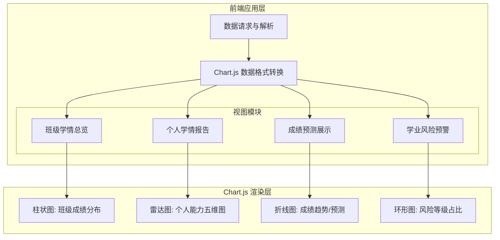
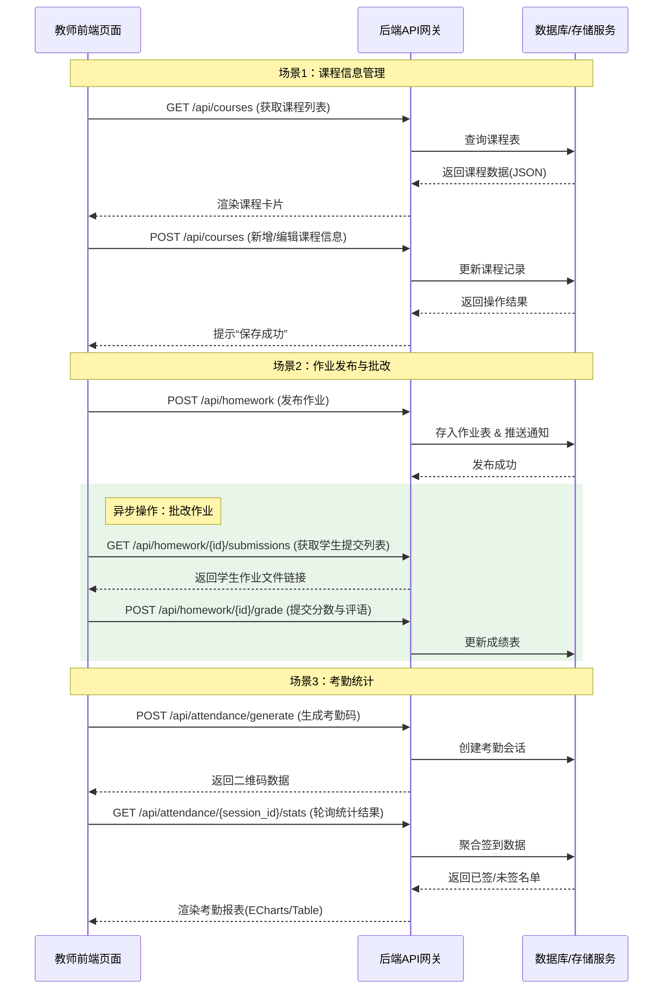
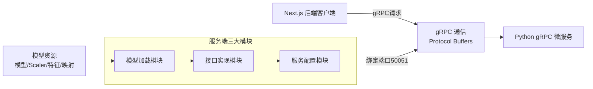

教学管理模块交互图



课程信息管理流程

```mermaid
<!-- 横向流程图 -->
graph LR
    A[开始] --> B(进入课程管理页面)
    B --> C{前端请求课程列表}
    C -->D[后端返回课程数据]
    D --> E[展示课程列表]
    E --> F{点击具体课程}
    F --> G[获取课程详情]
    G --> H[编辑/更新信息]
    H --> I[后端保存并返回结果]
    I --> J[提示更新成功]
    J --> K[结束]
```

<br />

### **作业发布与批改流程**

```mermaid
<!-- 横向流程图 -->
graph LR
    Start((开始)) --> Step1[发布新作业]
    Step1 -->API1[后端创建作业]
    API1 --> Step2[查看学生提交列表]
    Step2 --> API2[后端返回提交记录]
    API2 --> Step3{选择批改}
    Step3 --> Step4[在线打分/写评语]
    Step4 --> API3[后端更新成绩]
    API3 --> End((结束))
```

### gRPC 机器学习微服务架构图（Mermaid）


